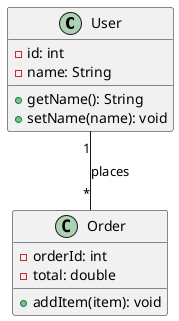

# Unified Modeling Language (UML)

## What is UML?

**UML (Unified Modeling Language)** is a standardized visual language for:
- Designing software systems
- Documenting architecture
- Communicating design decisions

It's like the **blueprint language** for software.

---

## Why Learn UML?

1. **Interviews**: LLD interviews often require UML diagrams
2. **Communication**: Explain designs to team members
3. **Documentation**: Create clear system documentation
4. **Planning**: Think through design before coding

---

## Types of UML Diagrams

### Structural Diagrams (What the system IS)
| Diagram | Purpose |
|---------|---------|
| **Class Diagram** | Shows classes and relationships |
| Object Diagram | Shows objects at a point in time |
| Component Diagram | Shows system components |
| Package Diagram | Shows packages and dependencies |

### Behavioral Diagrams (What the system DOES)
| Diagram | Purpose |
|---------|---------|
| Use Case Diagram | Shows user interactions |
| **Sequence Diagram** | Shows message flow over time |
| Activity Diagram | Shows workflows (like flowcharts) |
| State Diagram | Shows state transitions |

**For LLD interviews, focus on: Class Diagrams and Sequence Diagrams**

---

## Class Diagrams - The Most Important

A class diagram shows:
- Classes in the system
- Attributes (properties) of each class
- Methods (behaviors) of each class
- Relationships between classes

---

## Class Notation

```
┌─────────────────────────────────┐
│         <<ClassName>>           │  ← Class Name
├─────────────────────────────────┤
│ - privateAttribute: Type        │  ← Attributes
│ + publicAttribute: Type         │
│ # protectedAttribute: Type      │
├─────────────────────────────────┤
│ + publicMethod(): ReturnType    │  ← Methods
│ - privateMethod(): void         │
│ # protectedMethod(): Type       │
└─────────────────────────────────┘
```

### Access Modifiers:
- `+` → Public
- `-` → Private
- `#` → Protected
- `~` → Package/Default

---

## Example: User Class

### Java Code:
```java
public class User {
    private int id;
    private String name;
    private String email;
    protected Date createdAt;
    
    public User(String name, String email) {
        this.name = name;
        this.email = email;
    }
    
    public String getName() {
        return name;
    }
    
    public void setName(String name) {
        this.name = name;
    }
    
    public boolean isValid() {
        return email != null && email.contains("@");
    }
    
    private void logActivity() {
        // internal logging
    }
}
```

### UML Diagram:
```
┌─────────────────────────────────┐
│             User                │
├─────────────────────────────────┤
│ - id: int                       │
│ - name: String                  │
│ - email: String                 │
│ # createdAt: Date               │
├─────────────────────────────────┤
│ + User(name: String,            │
│        email: String)           │
│ + getName(): String             │
│ + setName(name: String): void   │
│ + isValid(): boolean            │
│ - logActivity(): void           │
└─────────────────────────────────┘
```

---

## Static and Abstract Notation

### Static Members (Underlined)
```
┌─────────────────────────────────┐
│          MathUtils              │
├─────────────────────────────────┤
│ + PI: double = 3.14159          │  ← underlined = static
├─────────────────────────────────┤
│ + sqrt(n: double): double       │  ← underlined = static
└─────────────────────────────────┘
```

### Abstract Class (Italics or <<abstract>>)
```
┌─────────────────────────────────┐
│     <<abstract>>                │
│          Shape                  │
├─────────────────────────────────┤
│ # x: int                        │
│ # y: int                        │
├─────────────────────────────────┤
│ + getArea(): double {abstract}  │  ← italics = abstract method
│ + moveTo(x: int, y: int): void  │
└─────────────────────────────────┘
```

### Interface
```
┌─────────────────────────────────┐
│      <<interface>>              │
│        Drawable                 │
├─────────────────────────────────┤
│                                 │
├─────────────────────────────────┤
│ + draw(): void                  │
│ + resize(scale: double): void   │
└─────────────────────────────────┘
```

---

## Relationships in Class Diagrams

### 1. Association (Uses/Knows About)

A basic relationship where one class uses another.

```
┌───────────┐         ┌───────────┐
│  Student  │─────────│  Course   │
└───────────┘         └───────────┘

Student knows about Course (or vice versa)
```

**Java Code:**
```java
class Student {
    private Course course;  // Student knows about Course
}
```

### 2. Aggregation (Has-A, Weak Ownership)

A "whole-part" relationship where parts can exist independently.

**Symbol: Empty Diamond ◇**

```
┌───────────┐        ┌───────────┐
│Department │◇───────│  Teacher  │
└───────────┘        └───────────┘

Department HAS Teachers, but Teachers can exist without Department
```

**Java Code:**
```java
class Department {
    private List<Teacher> teachers;  // Department has teachers
    
    public void addTeacher(Teacher teacher) {
        teachers.add(teacher);  // Teacher created elsewhere
    }
}

// Teachers exist independently
Teacher t1 = new Teacher("John");
Department dept = new Department();
dept.addTeacher(t1);  // Teacher can exist without department
```

### 3. Composition (Has-A, Strong Ownership)

A strong "whole-part" relationship where parts cannot exist without the whole.

**Symbol: Filled Diamond ◆**

```
┌───────────┐        ┌───────────┐
│   House   │◆───────│   Room    │
└───────────┘        └───────────┘

House OWNS Rooms. If House is destroyed, Rooms are destroyed too.
```

**Java Code:**
```java
class House {
    private List<Room> rooms;
    
    public House() {
        // House creates its own rooms
        rooms = new ArrayList<>();
        rooms.add(new Room("Living Room"));
        rooms.add(new Room("Bedroom"));
    }
}

// Rooms are created inside House, destroyed when House is destroyed
```

### 4. Inheritance (Is-A)

Subclass extends parent class.

**Symbol: Empty Triangle Arrow △**

```
        ┌───────────┐
        │   Animal  │
        └─────△─────┘
              │
     ┌────────┴────────┐
     │                 │
┌─────────┐      ┌─────────┐
│   Dog   │      │   Cat   │
└─────────┘      └─────────┘

Dog IS-A Animal, Cat IS-A Animal
```

**Java Code:**
```java
class Animal {
    public void eat() { }
}

class Dog extends Animal {
    public void bark() { }
}

class Cat extends Animal {
    public void meow() { }
}
```

### 5. Implementation (Implements Interface)

Class implements an interface.

**Symbol: Dashed Line with Empty Triangle △**

```
      ┌─────────────────┐
      │  <<interface>>  │
      │    Flyable      │
      └───────△─────────┘
              ┆
              ┆ (dashed line)
              ┆
        ┌─────────┐
        │  Bird   │
        └─────────┘

Bird IMPLEMENTS Flyable interface
```

**Java Code:**
```java
interface Flyable {
    void fly();
}

class Bird implements Flyable {
    @Override
    public void fly() {
        System.out.println("Flying...");
    }
}
```

### 6. Dependency (Uses Temporarily)

One class uses another temporarily (e.g., as method parameter).

**Symbol: Dashed Arrow -->**

```
┌───────────┐         ┌───────────┐
│ Document  │- - - - >│  Printer  │
└───────────┘         └───────────┘

Document temporarily uses Printer
```

**Java Code:**
```java
class Document {
    public void print(Printer printer) {  // Uses Printer temporarily
        printer.print(this.content);
    }
}
```

---

## Multiplicity (Cardinality)

Shows how many objects participate in a relationship.

| Notation | Meaning |
|----------|---------|
| `1` | Exactly one |
| `0..1` | Zero or one |
| `*` or `0..*` | Zero or more |
| `1..*` | One or more |
| `n..m` | Between n and m |

### Example:
```
┌─────────────┐  1        *  ┌─────────────┐
│   Company   │──────────────│  Employee   │
└─────────────┘              └─────────────┘

One Company has many (0 to infinity) Employees
Each Employee belongs to exactly 1 Company
```

```
┌─────────────┐  *        *  ┌─────────────┐
│   Student   │──────────────│   Course    │
└─────────────┘              └─────────────┘

Many-to-Many: Students can have many Courses
Courses can have many Students
```

---

## Complete Example: Library System

### Classes:
- Library
- Book
- Author
- Member
- Librarian
- Loan

### UML Class Diagram:

```
┌────────────────────────────┐
│          Library           │
├────────────────────────────┤
│ - name: String             │
│ - address: String          │
├────────────────────────────┤
│ + addBook(book: Book)      │
│ + removeBook(isbn: String) │
│ + findBook(isbn): Book     │
│ + registerMember(): Member │
└────────────────────────────┘
        ◆ 1
        │
        │ 1..*
        ▼
┌────────────────────────────┐          ┌────────────────────────────┐
│           Book             │ *      1 │          Author            │
├────────────────────────────┤──────────├────────────────────────────┤
│ - isbn: String             │          │ - name: String             │
│ - title: String            │          │ - biography: String        │
│ - isAvailable: boolean     │          ├────────────────────────────┤
├────────────────────────────┤          │ + getBooks(): List<Book>   │
│ + borrow(): boolean        │          └────────────────────────────┘
│ + return(): void           │
│ + getDetails(): String     │
└────────────────────────────┘
        │ 1
        │
        │ 0..1
        ▼
┌────────────────────────────┐
│           Loan             │
├────────────────────────────┤          ┌────────────────────────────┐
│ - issueDate: Date          │ *      1 │         Member             │
│ - dueDate: Date            │◁─────────├────────────────────────────┤
│ - returnDate: Date         │          │ - memberId: String         │
├────────────────────────────┤          │ - name: String             │
│ + isOverdue(): boolean     │          │ - email: String            │
│ + calculateFine(): double  │          ├────────────────────────────┤
└────────────────────────────┘          │ + borrowBook(book): Loan   │
                                        │ + returnBook(loan): void   │
                                        │ + getLoans(): List<Loan>   │
        ┌────────────────────────────┐  └────────────────────────────┘
        │       <<interface>>        │              △
        │         Person             │              │
        ├────────────────────────────┤              │
        │ + getName(): String        │    ┌────────┴────────┐
        │ + getEmail(): String       │    │                 │
        └────────────────────────────┘    │                 │
                    △                     │                 │
                    ┆               ┌─────────┐      ┌───────────┐
                    ┆               │ Member  │      │ Librarian │
                    └ ─ ─ ─ ─ ─ ─ ─ └─────────┘      └───────────┘
```

---

## Sequence Diagrams

Shows **messages between objects over time**.

### Basic Elements:
- **Actors**: Users or external systems (stick figures)
- **Objects**: Instances participating (rectangles)
- **Lifeline**: Vertical dashed line showing object lifetime
- **Messages**: Arrows between lifelines

### Example: User Login Sequence

```
    User          LoginController        AuthService         Database
     │                  │                    │                   │
     │  login(user,pwd) │                    │                   │
     │─────────────────>│                    │                   │
     │                  │  authenticate()    │                   │
     │                  │───────────────────>│                   │
     │                  │                    │  findUser(user)   │
     │                  │                    │──────────────────>│
     │                  │                    │      User         │
     │                  │                    │<──────────────────│
     │                  │                    │                   │
     │                  │    validatePassword()                  │
     │                  │                    │                   │
     │                  │     AuthResult     │                   │
     │                  │<───────────────────│                   │
     │   LoginResponse  │                    │                   │
     │<─────────────────│                    │                   │
     │                  │                    │                   │
```

### Message Types:
- **Solid Arrow →**: Synchronous call (wait for response)
- **Dashed Arrow ← - -**: Return/Response
- **Open Arrow ->>**: Asynchronous call (don't wait)

---

## Example: ATM Withdrawal Sequence

```
    Customer         ATM            BankServer         Account
        │              │                 │                │
        │ insertCard() │                 │                │
        │─────────────>│                 │                │
        │              │  validateCard() │                │
        │              │────────────────>│                │
        │              │     valid       │                │
        │              │<────────────────│                │
        │ enterPIN()   │                 │                │
        │─────────────>│                 │                │
        │              │  verifyPIN()    │                │
        │              │────────────────>│                │
        │              │    success      │                │
        │              │<────────────────│                │
        │ requestAmount│                 │                │
        │─────────────>│                 │                │
        │              │  checkBalance() │                │
        │              │────────────────>│                │
        │              │                 │  getBalance()  │
        │              │                 │───────────────>│
        │              │                 │    balance     │
        │              │                 │<───────────────│
        │              │  withdraw()     │                │
        │              │────────────────>│                │
        │              │                 │  debit(amount) │
        │              │                 │───────────────>│
        │              │                 │    success     │
        │              │                 │<───────────────│
        │              │    success      │                │
        │              │<────────────────│                │
        │  dispenseCash│                 │                │
        │<─────────────│                 │                │
        │              │                 │                │
```

---

## Use Case Diagram (Brief)

Shows **what the system does** from user's perspective.

```
                    ┌─────────────────────────────────────┐
                    │         Library System              │
                    │                                     │
    ┌───┐           │    ┌─────────────────┐             │
    │   │◄──────────│────│   Search Book   │             │
    │   │           │    └─────────────────┘             │
    │───│           │                                     │
    │   │Member     │    ┌─────────────────┐             │
    │   │◄──────────│────│   Borrow Book   │             │
    └───┘           │    └─────────────────┘             │
                    │                                     │
                    │    ┌─────────────────┐             │
    ┌───┐           │    │   Return Book   │             │
    │   │Librarian◄─│────┤                 │             │
    │───│           │    └─────────────────┘             │
    │   │           │                                     │
    └───┘           │    ┌─────────────────┐             │
                    │    │    Add Book     │             │
                    │    └─────────────────┘             │
                    │                                     │
                    └─────────────────────────────────────┘
```

---

## Tips for Drawing UML in Interviews

### 1. Start with Main Classes
List the main entities first.

### 2. Add Attributes and Methods
- Public methods that define behavior
- Key private attributes

### 3. Show Relationships
- Inheritance (△)
- Composition (◆)
- Association (—)

### 4. Add Multiplicity
Show how many objects relate.

### 5. Keep It Clean
- Don't include getters/setters unless important
- Focus on key methods
- Use clear spacing

---

## Common UML Tools

1. **draw.io** (free, web-based)
2. **Lucidchart** (web-based)
3. **PlantUML** (text-based, integrates with IDEs)
4. **Visual Paradigm**
5. **StarUML**

### PlantUML Example:


---

## Summary

| Diagram Type | Used For |
|--------------|----------|
| Class Diagram | Structure, relationships |
| Sequence Diagram | Object interactions over time |
| Use Case Diagram | System features from user view |

### Key Relationships:
| Symbol | Relationship |
|--------|--------------|
| ——— | Association |
| ◇—— | Aggregation (weak has-a) |
| ◆—— | Composition (strong has-a) |
| △—— | Inheritance (is-a) |
| △- - | Implementation |
| - -> | Dependency |

---

**Next: Introduction to Design Patterns →**
